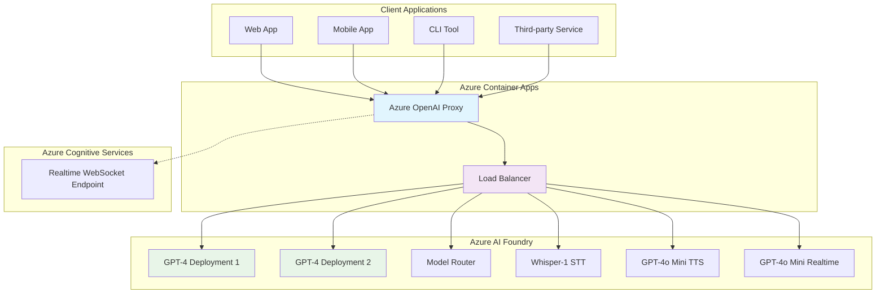
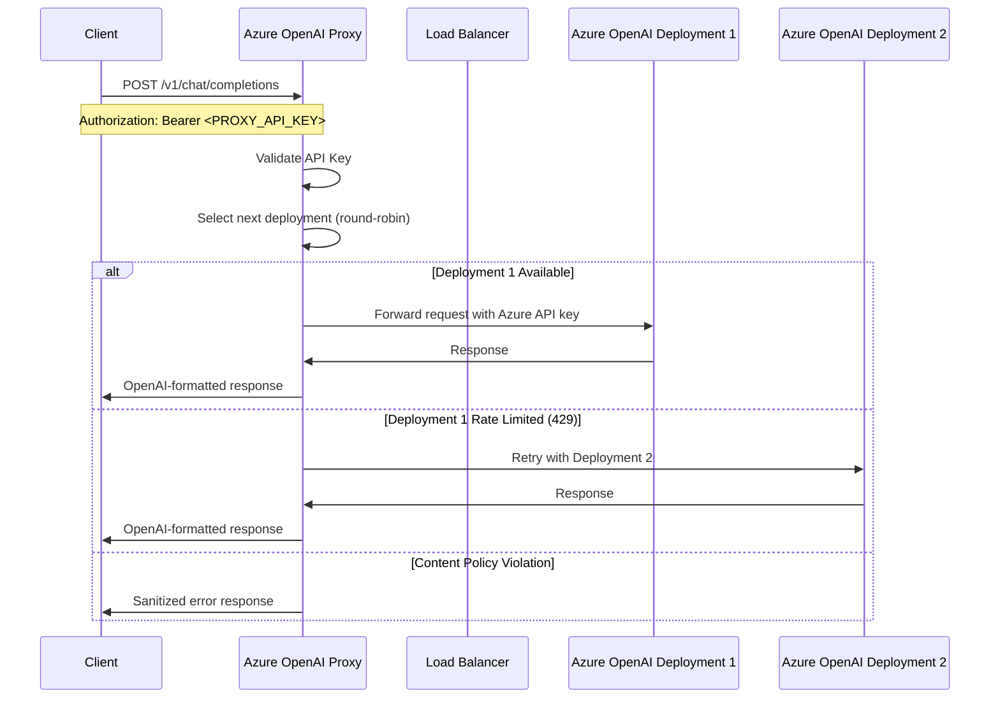
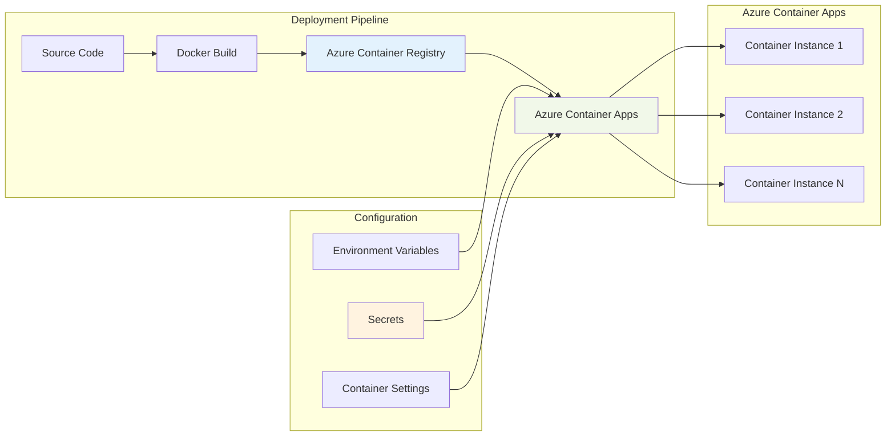
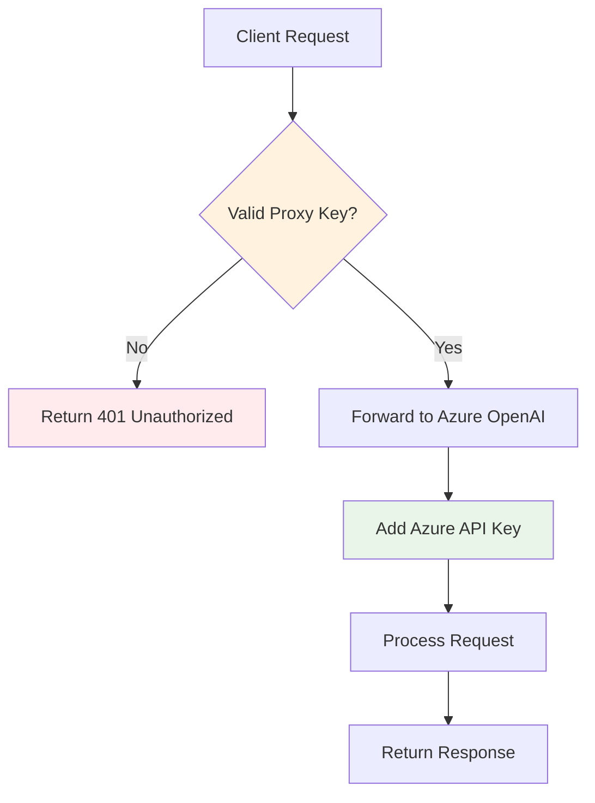

# Azure OpenAI Proxy - Design & Installation Guide

## Overview

The Azure OpenAI Proxy is a FastAPI-based service that provides an OpenAI-compatible interface for Azure OpenAI services. It translates standard OpenAI API calls to Azure-specific endpoints, enabling seamless integration with existing OpenAI-based applications while leveraging Azure's AI services.

## Architecture Overview



## System Components

### Core Features

- **OpenAI-Compatible API**: Translates OpenAI API calls to Azure OpenAI format
- **Load Balancing**: Round-robin distribution across multiple Azure deployments
- **Multi-Modal Support**: Text, audio transcription, text-to-speech, and real-time chat
- **WebSocket Support**: Real-time streaming conversations
- **Security**: API key authentication and secure secret management
- **Containerized Deployment**: Docker-based deployment on Azure Container Apps

### Supported Endpoints

| Endpoint | Method | Purpose | Azure Backend |
|----------|--------|---------|---------------|
| `/v1/chat/completions` | POST | Chat completions | GPT-4 deployments with round-robin |
| `/v1/audio/transcriptions` | POST | Speech-to-text | Whisper-1 |
| `/v1/audio/speech` | POST | Text-to-speech | GPT-4o Mini |
| `/v1/realtime/sessions` | WebSocket | Real-time chat | GPT-4o Mini Realtime |

## Data Flow Architecture



## Prerequisites

### Azure Resources Required

1. **Azure AI Foundry Hub** with the following deployments:
   - `gpt-4-04-14-uplyf-1` (GPT-4 model)
   - `gpt-4-04-14-uplyf-2` (GPT-4 model)
   - `model-router-uplyf` (Model router)
   - `whisper-1` (Speech-to-text)
   - `gpt-4o-mini-realtime-preview` (TTS & Realtime)

2. **Azure Container Registry** (for storing Docker images)

3. **Azure Container Apps Environment**

4. **Azure Resource Group** (e.g., `Uplyf`)

### Development Environment

- Python 3.11+
- Docker
- Azure CLI
- Git

## Installation & Setup

### Step 1: Clone and Prepare the Repository

```bash
# Clone the repository
git clone <repository-url>
cd azureopenaiproxy

# Verify file structure
ls -la
# Should show: main.py, requirements.txt, DockerFile, etc.
```

### Step 2: Configure Environment Variables

Create a `.env` file for local development:

```bash
# .env file
AZURE_OPENAI_API_KEY=your-azure-openai-api-key
PROXY_API_KEY=your-very-strong-random-key
```

### Step 3: Local Development Setup

```bash
# Create virtual environment
python -m venv venv
source venv/bin/activate  # On Windows: venv\Scripts\activate

# Install dependencies
pip install -r requirements.txt

# Run locally for testing
uvicorn main:app --host 0.0.0.0 --port 8080 --reload
```

### Step 4: Build and Push Docker Image

```bash
# Build Docker image
docker build -t azureopenaiproxy:latest .

# Tag for Azure Container Registry
docker tag azureopenaiproxy:latest uplyf-g5ghdba7gkgxfdb0.azurecr.io/azureopenaiproxy:latest

# Login to Azure Container Registry
az acr login --name uplyf-g5ghdba7gkgxfdb0

# Push image
docker push uplyf-g5ghdba7gkgxfdb0.azurecr.io/azureopenaiproxy:latest
```

## Azure Deployment

### Deployment Architecture



### Step 1: Create Secrets in Azure Container App

```bash
# Create the proxy API key secret
az containerapp secret set \
  --name azureopenaiproxy \
  --resource-group Uplyf \
  --secrets proxy-api-key='your-very-strong-random-key'

# Create the Azure OpenAI API key secret
az containerapp secret set \
  --name azureopenaiproxy \
  --resource-group Uplyf \
  --secrets azure-openai-api-key='your-azure-api-key'
```

### Step 2: Create Azure Container App

```bash
az containerapp create \
  --name azureopenaiproxy \
  --resource-group Uplyf \
  --environment your-container-apps-environment \
  --image uplyf-g5ghdba7gkgxfdb0.azurecr.io/azureopenaiproxy:latest \
  --target-port 8080 \
  --ingress external \
  --min-replicas 1 \
  --max-replicas 10 \
  --cpu 0.5 \
  --memory 1Gi \
  --env-vars \
    AZURE_OPENAI_URL='https://uplyf-ai-foundry.openai.azure.com/openai/deployments/gpt-4-04-14-uplyf/chat/completions?api-version=2025-01-01-preview' \
    AZURE_OPENAI_API_KEY=secretref:azure-openai-api-key \
    PROXY_API_KEY=secretref:proxy-api-key
```

### Step 3: Update Container App with Secrets

```bash
# Map environment variables to secrets
az containerapp update \
  --name azureopenaiproxy \
  --resource-group Uplyf \
  --set-env-vars \
    AZURE_OPENAI_API_KEY=secretref:azure-openai-api-key \
    PROXY_API_KEY=secretref:proxy-api-key
```

## Configuration Management

### Environment Variables

| Variable | Purpose | Example |
|----------|---------|---------|
| `AZURE_OPENAI_API_KEY` | Azure OpenAI authentication | `secretref:azure-openai-api-key` |
| `PROXY_API_KEY` | Proxy service authentication | `secretref:proxy-api-key` |
| `AZURE_OPENAI_URL` | Base Azure OpenAI endpoint | `https://uplyf-ai-foundry.openai.azure.com/...` |

### Secret Management

Secrets are managed through Azure Container Apps secret store:

```bash
# Update secret when Azure OpenAI key rotates
az containerapp secret set \
  --name azureopenaiproxy \
  --resource-group Uplyf \
  --secrets azure-openai-api-key='new-azure-api-key'

# Restart container app to pick up new secrets
az containerapp restart \
  --name azureopenaiproxy \
  --resource-group Uplyf
```

## Maintenance & Updates

### Updating the Application

```bash
# 1. Build new image with updated tag
docker build -t azureopenaiproxy:v2.0 .
docker tag azureopenaiproxy:v2.0 uplyf-g5ghdba7gkgxfdb0.azurecr.io/azureopenaiproxy:v2.0
docker push uplyf-g5ghdba7gkgxfdb0.azurecr.io/azureopenaiproxy:v2.0

# 2. Update container app with new image
az containerapp update \
  --name azureopenaiproxy \
  --resource-group Uplyf \
  --image uplyf-g5ghdba7gkgxfdb0.azurecr.io/azureopenaiproxy:v2.0
```

### Monitoring and Troubleshooting

```bash
# Check deployment status
az containerapp show \
  --name azureopenaiproxy \
  --resource-group Uplyf \
  --query properties.latestRevisionName

# View live logs
az containerapp logs show \
  --name azureopenaiproxy \
  --resource-group Uplyf \
  --follow

# Check container app health
az containerapp show \
  --name azureopenaiproxy \
  --resource-group Uplyf \
  --query properties.provisioningState
```

## API Usage Examples

### Chat Completions

```bash
curl -X POST "https://your-container-app-url/v1/chat/completions" \
  -H "Authorization: Bearer your-proxy-api-key" \
  -H "Content-Type: application/json" \
  -d '{
    "model": "gpt-4-04-14-uplyf",
    "messages": [
      {"role": "user", "content": "Hello, how are you?"}
    ]
  }'
```

### Audio Transcription

```bash
curl -X POST "https://your-container-app-url/v1/audio/transcriptions" \
  -H "Authorization: Bearer your-proxy-api-key" \
  -F "file=@audio.mp3" \
  -F "model=whisper-1"
```

### Text-to-Speech

```bash
curl -X POST "https://your-container-app-url/v1/audio/speech" \
  -H "Authorization: Bearer your-proxy-api-key" \
  -H "Content-Type: application/json" \
  -d '{
    "model": "tts-1",
    "input": "Hello world",
    "voice": "alloy"
  }' \
  --output speech.mp3
```

### WebSocket Real-time Chat

```javascript
const ws = new WebSocket('wss://your-container-app-url/v1/realtime/sessions?key=your-proxy-api-key');

ws.onopen = () => {
  console.log('Connected to realtime API');
  // Send configuration
  ws.send(JSON.stringify({
    type: 'session.update',
    session: {
      model: 'gpt-4o-mini-realtime-preview',
      voice: 'alloy'
    }
  }));
};

ws.onmessage = (event) => {
  const data = JSON.parse(event.data);
  console.log('Received:', data);
};
```

## Security Considerations

### Authentication Flow



### Security Best Practices

1. **API Key Rotation**: Regularly rotate both proxy and Azure OpenAI API keys
2. **Secret Management**: Use Azure Container Apps secrets, never hardcode keys
3. **Network Security**: Configure appropriate ingress rules and IP restrictions
4. **Monitoring**: Enable logging and monitoring for unusual activity patterns
5. **Rate Limiting**: Consider implementing additional rate limiting at the proxy level

## Scaling and Performance

### Auto-scaling Configuration

The Container App is configured with auto-scaling:
- **Min Replicas**: 1 (always-on)
- **Max Replicas**: 10 (scales based on demand)
- **CPU/Memory**: 0.5 CPU, 1Gi memory per instance

### Load Balancing Strategy

The proxy implements round-robin load balancing between Azure OpenAI deployments:
- Automatic failover on rate limits (HTTP 429)
- Retry logic with different deployments
- Graceful handling of content policy violations

## Troubleshooting Guide

### Common Issues

| Issue | Symptoms | Solution |
|-------|----------|----------|
| Authentication Errors | 401 responses | Check proxy API key configuration |
| Rate Limiting | 429 responses | Add more Azure deployments or increase quotas |
| Content Filtering | Blocked responses | Review and adjust Azure content policies |
| WebSocket Connection Issues | Connection failures | Verify WebSocket endpoint and authentication |

### Debug Commands

```bash
# Check container logs for errors
az containerapp logs show --name azureopenaiproxy --resource-group Uplyf --tail 100

# Verify environment variables
az containerapp show --name azureopenaiproxy --resource-group Uplyf --query properties.template.containers[0].env

# Test endpoint connectivity
curl -v https://your-container-app-url/health
```

## Performance Metrics

Monitor these key metrics:
- **Response Time**: Average API response time
- **Error Rate**: Percentage of failed requests
- **Throughput**: Requests per minute
- **Resource Utilization**: CPU and memory usage
- **Deployment Health**: Individual Azure deployment status

---

*This document provides a comprehensive guide for deploying and maintaining the Azure OpenAI Proxy service. Keep it updated as the system evolves and new features are added.*